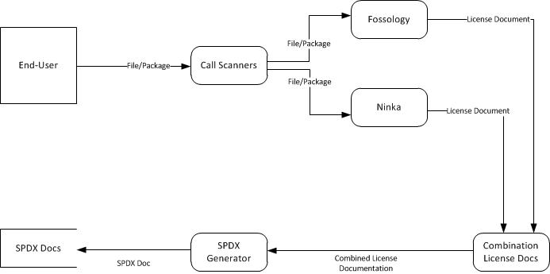

Data Flow
=========

Overview
--------
This document describes the data flow between components of FOSSology-Ninka and third-party components.

DFD Annotations
---------------

### Run Scanners [(mockup code)](https://github.com/TheFinks/Fossology-Ninka/tree/master/design/code_mockups/run_scanner)

Run Scanners will collect the file or package from the end-user and send it to both FOSSology and Ninka. Both tools attempt to automatically locate license declarations within files. Both tools are external modules and treated as black boxes for the purpose of this diagram.

**Procedure:**

1. INPUT (FILE or PACKAGE)
2. IF INPUT is FILE:
    1. FOSSology (FILE)
    2. Ninka (FILE)
3. ELSE:
    1. UNPACK PACKAGE as TEMP
    2. FOR EACH FILE in TEMP:
        1. FOSSology (FILE)
        2. Ninka (FILE)

### Combine License Docs

Combine License Docs will be used to accept the output of both the FOSSology and Ninka scanning tools. After accepting both outputs this module will compare and combine the outputs.

**Procedure:**

1. INPUT (FOSSOLOGY_OUT, NINKA_OUT)
2. READ (FOSSOLOGY_OUT) as R1
3. READ (NINKA_OUT) as R2
4. COMPARE (R1, R2): *# Compares R1 and R2 line by line; assumes the files are sorted in the same order*
    1. IF R1 has LICENSE and R2 has NONE or ERROR:
        1. WRITE R1.LICENSE to COMBINED_INFO
    2. ELSE IF R2 has LICENSE and R1 has NONE or ERROR:
        1. WRITE R2.LICENSE to COMBINED_INFO
    3. ELSE IF R1.LICENSE == R2.LICENSE:
        1. WRITE R1.LICENSE to COMBINED_INFO *# R1 and R2 are identical; either one works*
    4. ELSE IF R1.LICENSE != R2.LICENSE:
        1. WRITE “LICENSE_DECLARED = NOASSERTION; COMMENTS = ‘CONFLICT’” to COMBINED_INFO *# Not the actual output format; just an example*

### SPDX Generator [(mockup code)](https://github.com/TheFinks/Fossology-Ninka/tree/master/design/code_mockups/spdx_generator)

The SPDX generator will accept the output from the Combine License Docs module and convert the document into a JSON SPDX file.

**Procedure:**

1.	INPUT (COMBINED_INFO) *# Combined license documentation*
2.	CREATE FILE (NAME = FINAL_DOC, FORMAT = JSON, SCHEMA = SPDX-1.2)
3.	IF COMBINED_INFO.FILE_FORMAT == PACKAGE:
    1.	FOR LINE in COMBINED_INFO: *# Multiple lines for a package*
        1.	WRITE (LINE.LICENSE_DECLARED) to FINAL_DOC.LICENSE_DECLARED
        2.	WRITE (LINE.COMMENTS) to FINAL_DOC.COMMENTS *# Even if no conflicts are recorded in the comments, this ensures comments for other purposes are included*
4.	ELSE:
    1.	WRITE (LINE.LICENSE_DECLARED) to FINAL_DOC.LICENSE_DECLARED
    2.	WRITE (LINE.COMMENTS) to FINAL_DOC.COMMENTS
