Command Line Mockup Walkthrough
===============================

This is a brief walkthrough of the FOSSology-Ninka software scanner and SPDX generator. This walkthrough was based on a mockup emulating the results.  The software meant to create the system is incomplete.

This does not assume ANY knowledge about Linux, so some of these steps may seem a bit trivial to people who understand how to do some of these things themselves.

This mockup is divided into four sections.

1. Section 1 is the installation and configuration of necessary files. The bulk of it is how to configure FOSSology.
2. Section 2 is what it looks like from a user's perspective when using the system from the command line.
3. Section 3 is what it looks like from a user’s perspective if the system is being used from a web interface.
4. Section 4 takes a look "under the hood" and shows how the scanner works point by point.

**Disclaimer:** I am not sure how much configuration of FOSSology is needed to run it in the way our system is intending.  However, until we know otherwise, we are assuming a full installation and configuration are necessary.

1.  The installation of FOSSology and Ninka
------------------------------------------------

FOSSology is rather difficult to configure.  Unfortunately this cannot be automated.  The majority of this part will be a brief walkthrough as to what the user may need to do to configure their home system.  This is not comprehensive and only goes into general details.  See [the FOSSology wiki](http://www.FOSSology.org/projects/FOSSology/wiki/SysConfig) for more information about how to configure FOSSology.

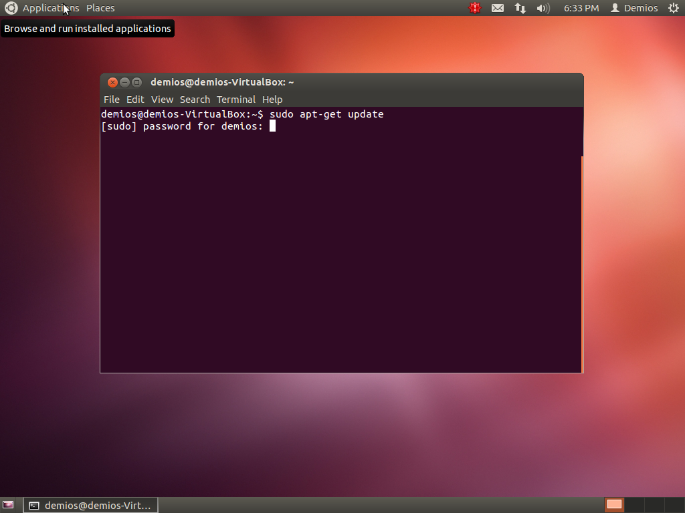
First you need to update your system.  Be sure to get root access (use sudo)

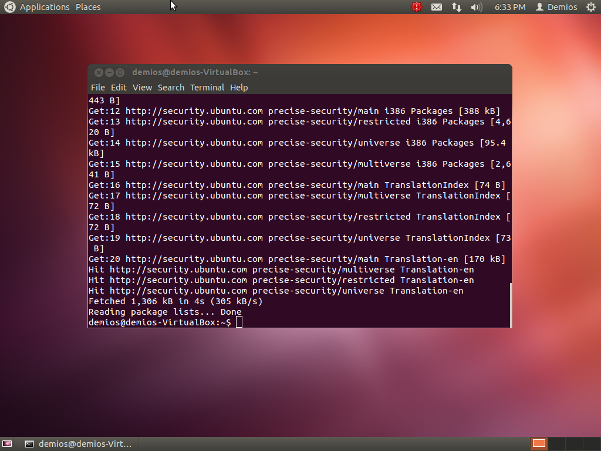
This is what it should look like when you are done updating

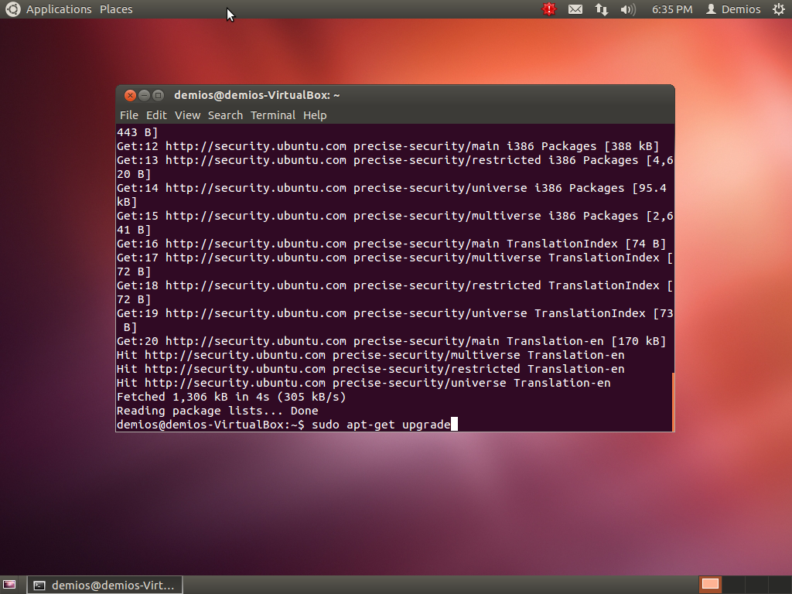
Next, you will need to upgrade your system to make sure no obsolete drivers are there before installation (remember to use sudo)

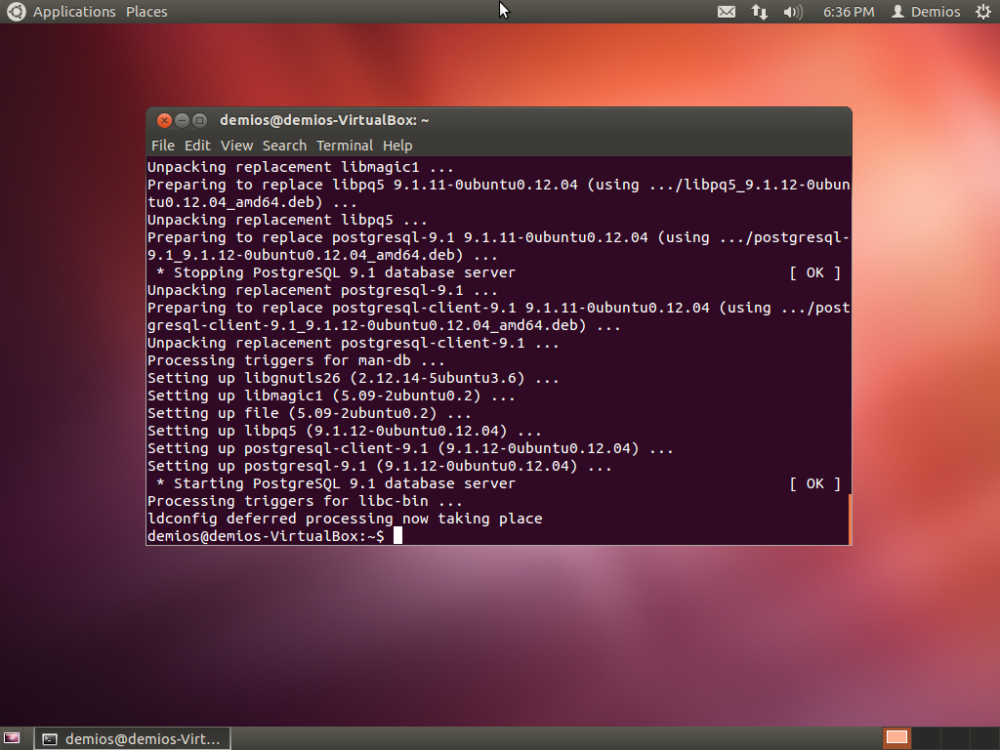
This is what it should look like upon completing the upgrade

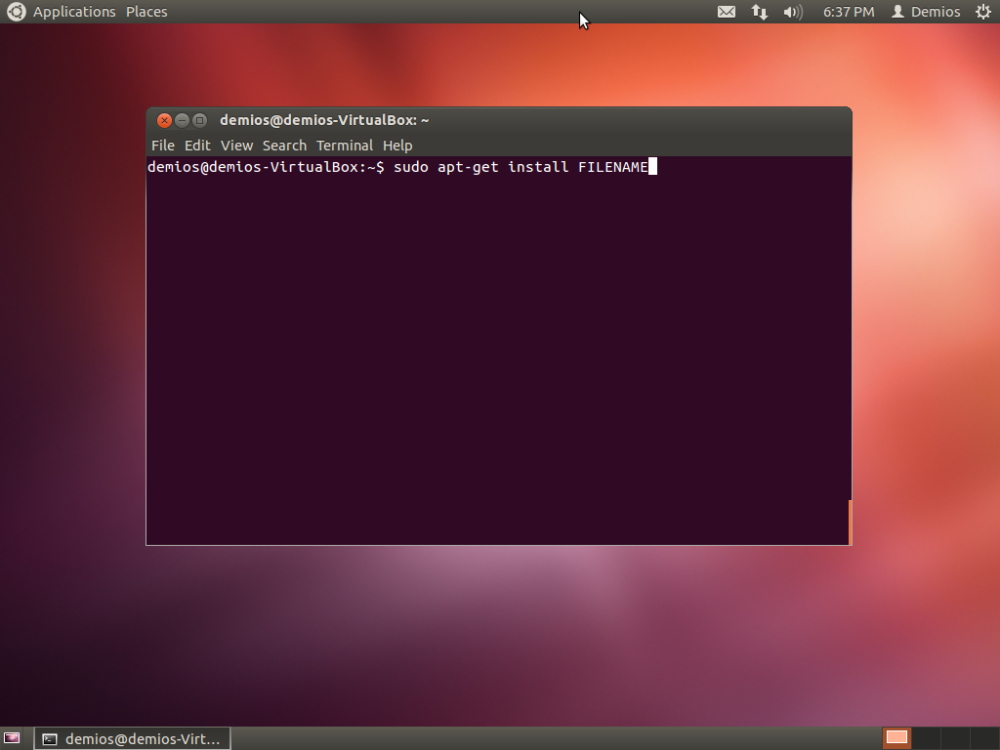
You will need to install several files.  For the sake of time I will not show a screen shot of every one of them.  Replace FILENAME with any of the files you need to install.  These files include php5, apache2, and postgresql.  Also if python and Perl are not present on the system, they need to be installed as well.  Again, just replace FILENAME with whatever you intend to install.  Linux will do the rest.

Now to install FOSSology itself.  As you can see, the procedure is the exact same as when files such as apache2 were installed.

**Note:** if you have a system with less than 1 GB of memory, you may want to skip the next four steps, as they are meant to address needed changes on larger systems.

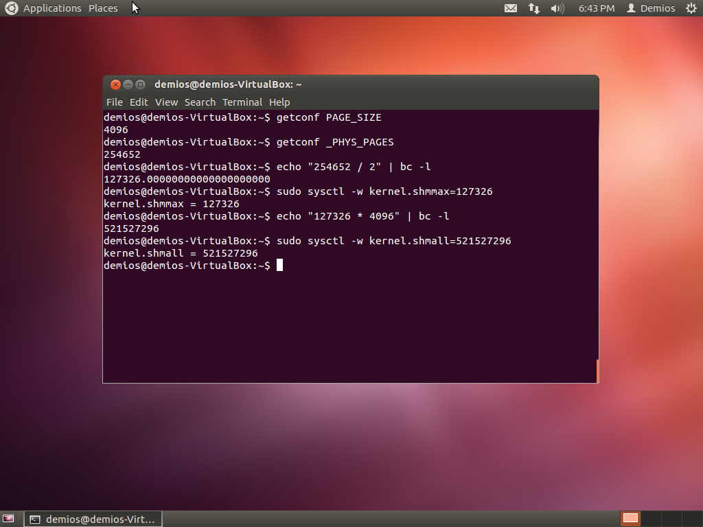
This part is a bit tricky.  Postgresql needs to be optimized to handle larger files.  The first step is to reconfigure your system to give out larger memory blocks.  The first step is to determine how large a single memory page is.  Keep this number in your mind, you'll need it later.  The second step is to determine how many physical pages you have.  The picture demonstrates how to get that information (getconf PAGE_SIZE and getconf _PHYS_PAGES, respectively).  For a value called shmall, you want it to be equivalent to HALF the amount of physical pages.  The picture demonstrates how to do that.  Then you use a command called sysctl to reset a value called kernel.shmall to that amount.  The picture demonstrates how to do that too (**WARNING:** I accidentally swapped shmall and shmmax in this demonstration, use shmall where I put shmmax and vice versa).  Next, you multiply the new shmall value by the size of a page.  This is because shmmax is in bytes.  Take the result and use sysctl to make that your shmmax.  The picture demonstrates how to do that (**WARNING:** Again, I accidentally swapped shmall and shmmax, use shmall where I put shmmax and vice versa).

Keep in mind that the picture is based on the values on my system, they may be different for yours.  For obvious reasons, you should use your numbers.

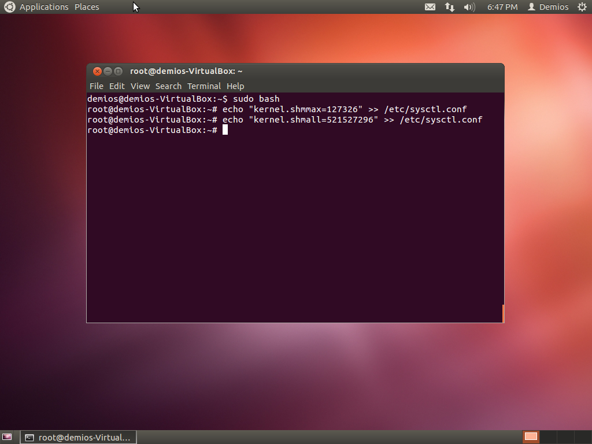
You will want to make sure these changes happen every time the system boots up, so you don't have to go through this whole ordeal again.  In order to do that, you need root access.  To do this, type 'sudo bash.'  Once you do this, use echo to send the kernel.shmall and kernel.shmmax values to a file called /etc/sysctl.conf. (**WARNING:** Again, I accidentally swapped shmall and shmmax in the picture.  Please use shmmax where I put shmall and vice versa).

Keep in mind that the picture is based on the values on my system, they may be different for yours.  For obvious reasons, you should use your numbers.

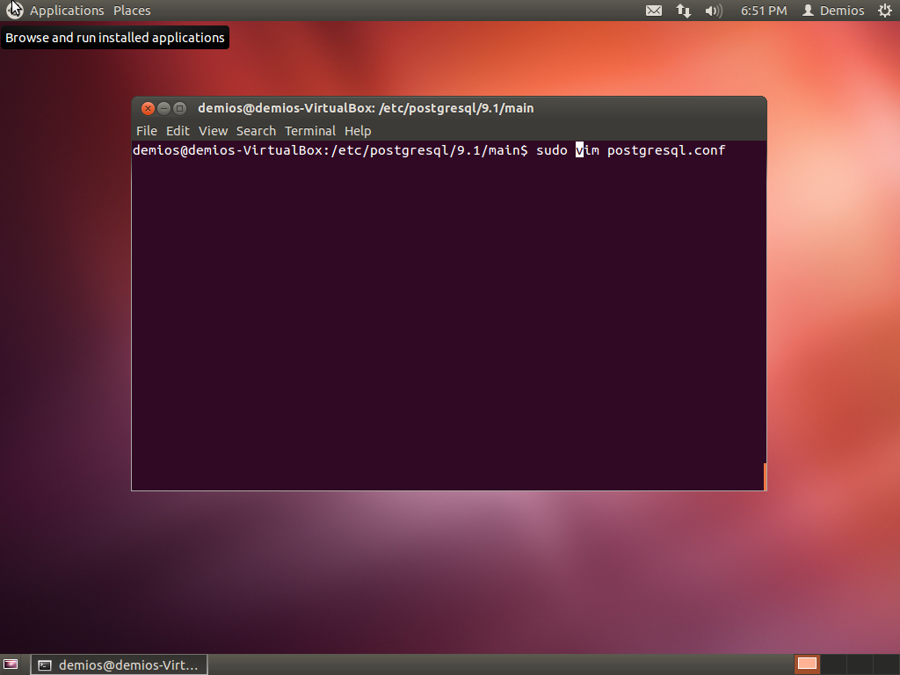
Next we have to configure postgresql. Go to the directory /etc/postgresql/(version number)/main.  Edit a file called postgresql.conf.  Because it is read only, you need to use sudo

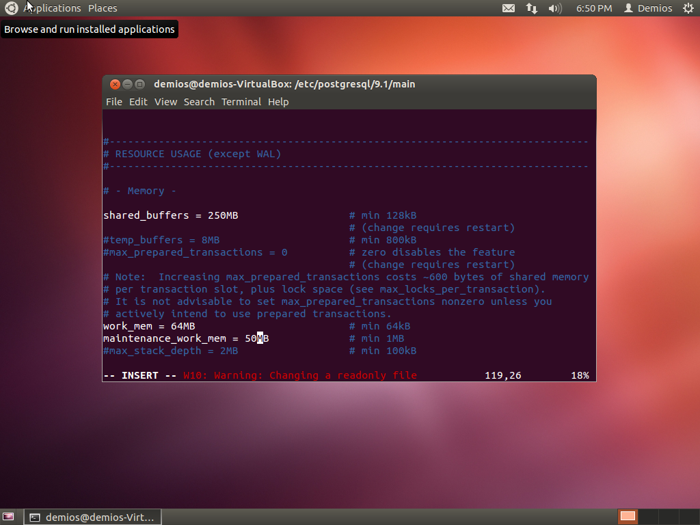
You will need to change a number of variables in this file to accommodate larger files.  Due to time constraints, I will not list what you need to change here.  However, you can find the variables and the suggested values (depending on your RAM) at [http://www.FOSSology.org/projects/FOSSology/wiki/SysConfig](http://www.FOSSology.org/projects/FOSSology/wiki/SysConfig)

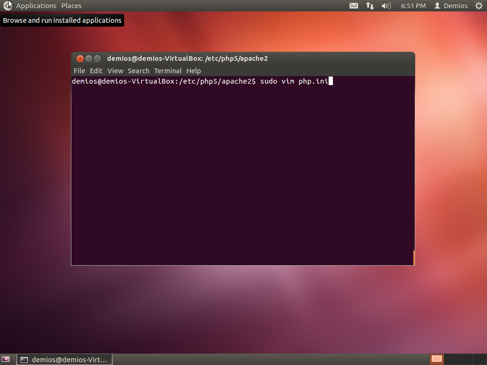
Next you need to go to the directory /etc/php5/apache2 and edit the file php.ini.  Since this is read only, you need to 'sudo' it.

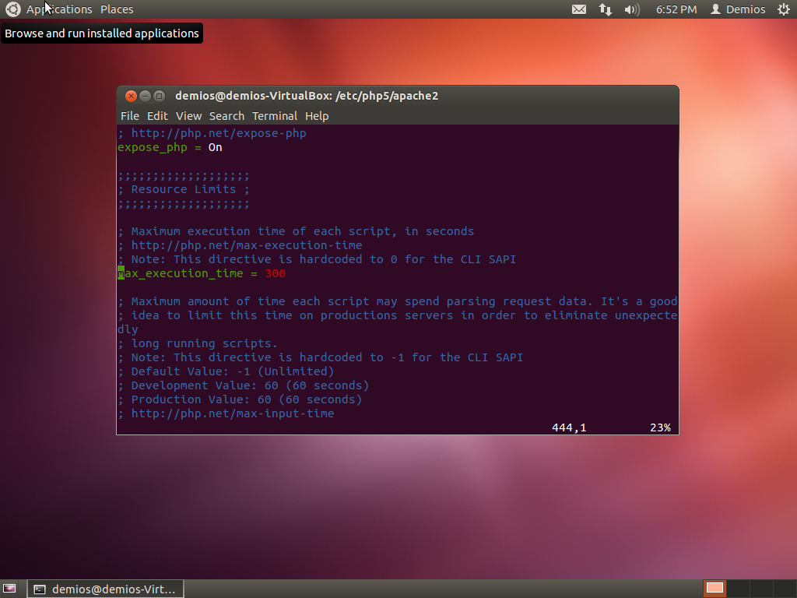
You will need to change some variables to allow FOSSology to intake larger files.  Due to time constraints I will not list the specific variables here.  However, you can find all the variables and suggested values at [http://www.FOSSology.org/projects/FOSSology/wiki/SysConfig](http://www.FOSSology.org/projects/FOSSology/wiki/SysConfig)

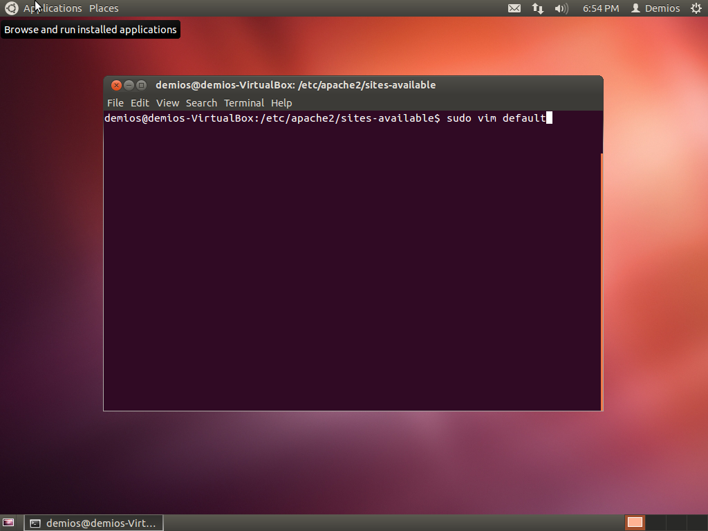
Next you will need to configure apache.  Go to the directory /etc/apache2/sites-available and edit the file called default (again, you need to 'sudo' it).

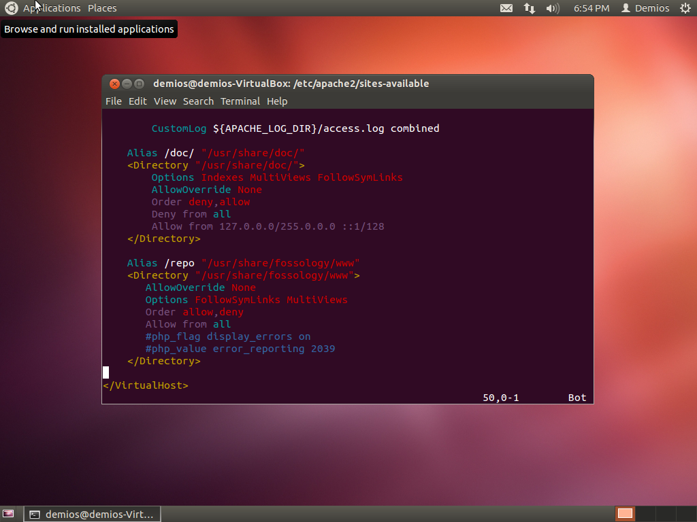
Create a directory similar to the one in the picture.  The path to FOSSology (where the picture has "/usr/share/FOSSology/www") may be different on your system.  If you load up a web browser, assuming you got the directory correct, you will find the default UI of FOSSology that way.  This system does not utilize that UI, but this is included in case the configuration is necessary for how our system runs FOSSology.

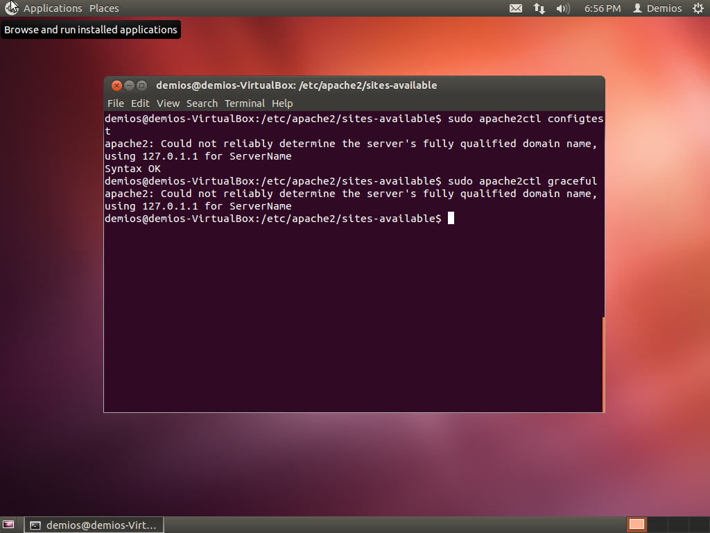
Next, test and reboot apache2.  To test it, use a command called "apache2ctl configtest" (without the quotes), and again, sudo is needed.  If it works, it will show a similar screen as to the one above (the name may be different if you gave your apache server a domain name, which is outside the scope of this walkthrough/mockup).  Once your configuration is confirmed, type in "apache2ctl graceful" (again, no quotes, but there is a sudo) to get apache up and running.  Despite what the picture shows, it doesn't matter what directory you are in for this, so don't worry if you aren't in the directory the picture is in.

One more trip to postgresql (or the first, if your system has relatively low memory and you skipped those steps).  Go to /etc/postgresql/(version number)/main, and edit the file pg_hba.conf.  Once again, you gotta sudo this thing.

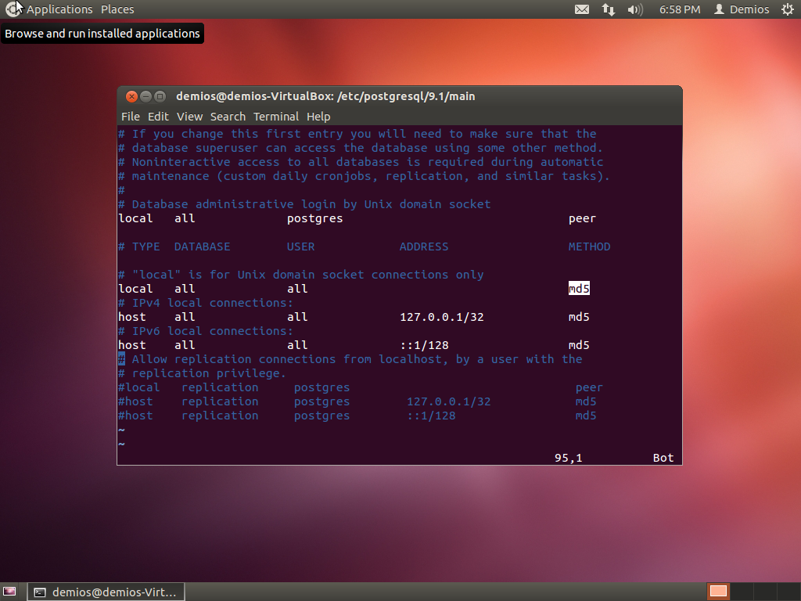
For a local connection to postgresql (which FOSSology uses), you need to make sure the connection style is md5.  If the variable highlighted in the picture is not md5 on your system (by default it is peer), then change it to md5.

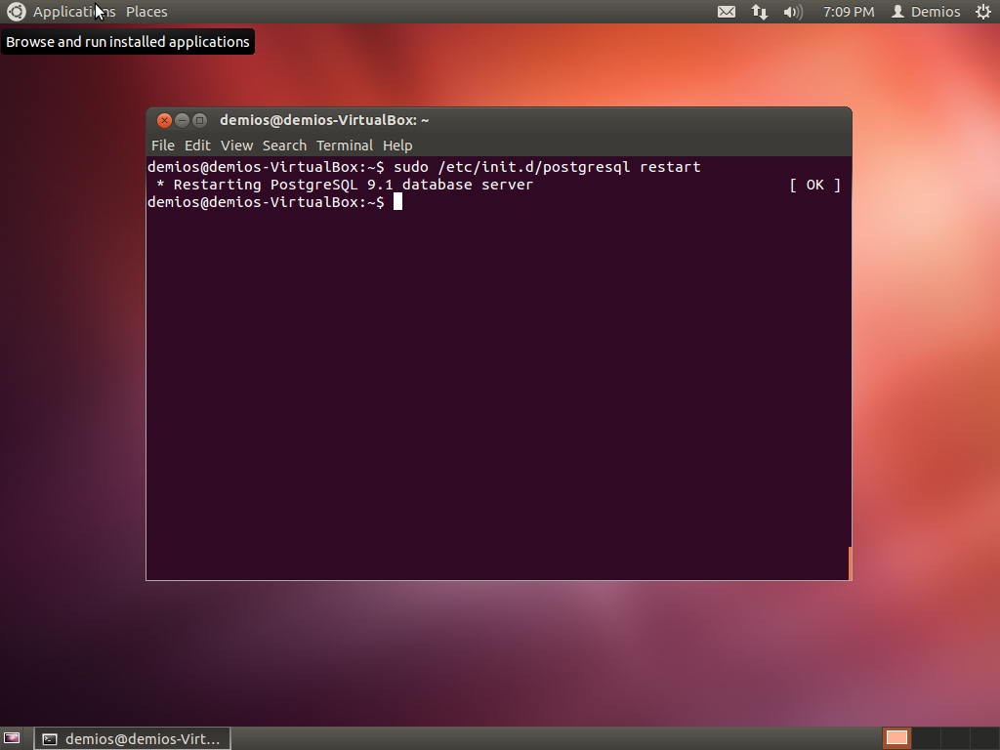
Now we can restart postgresql.  If everything worked out well, it will restart and all things will work.  You have to sudo it to get the restart to work.  The command is as shown in the picture (sudo /etc/init.d/postgresql restart).  Your postgresql may have a slightly different directory, depending on the version.

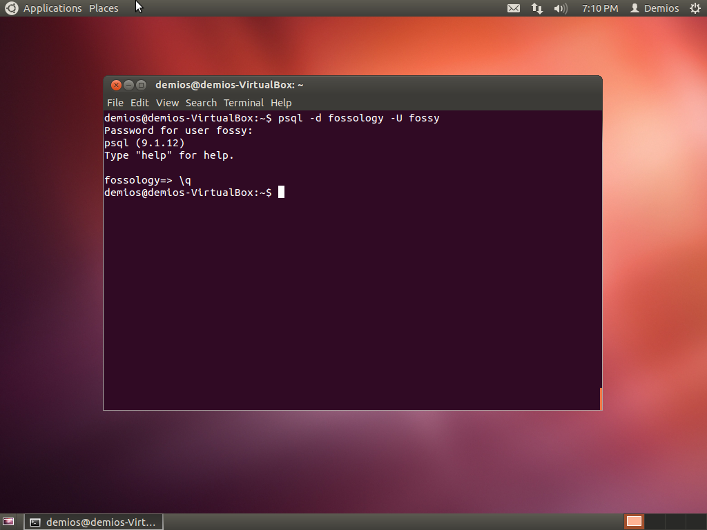
Now to test to see if postgresql is willing to talk to FOSSology.  The default name and password is fossy.  Execute the command shown in the picture (psql -d FOSSology -U fossy) and it should work.  Once you confirm the connection works, type \q to leave postgresql

Installing and configuring FOSSology is by FAR the hardest part of getting this system to run.  If you made it this far (for those following along at home), then you are 80% done with getting this mockup to work (if that's your intention).

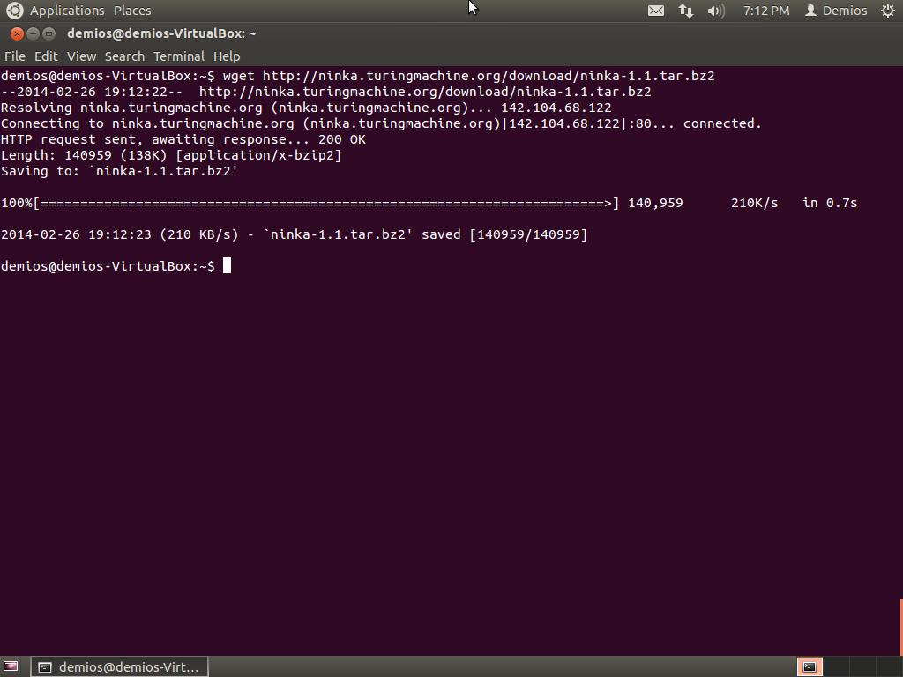
Ninka is MUCH easier to install then FOSSology.  However, since it's not on Ubuntu’s database (assuming you are using Ubuntu 12.04 as the dev team is), you will need to retrieve it manually. The preferred method is using wget.  The command at the top of the picture (wget [WHERE NINKA'S DOWNLOAD IS]) is how you get the archive holding Ninka.

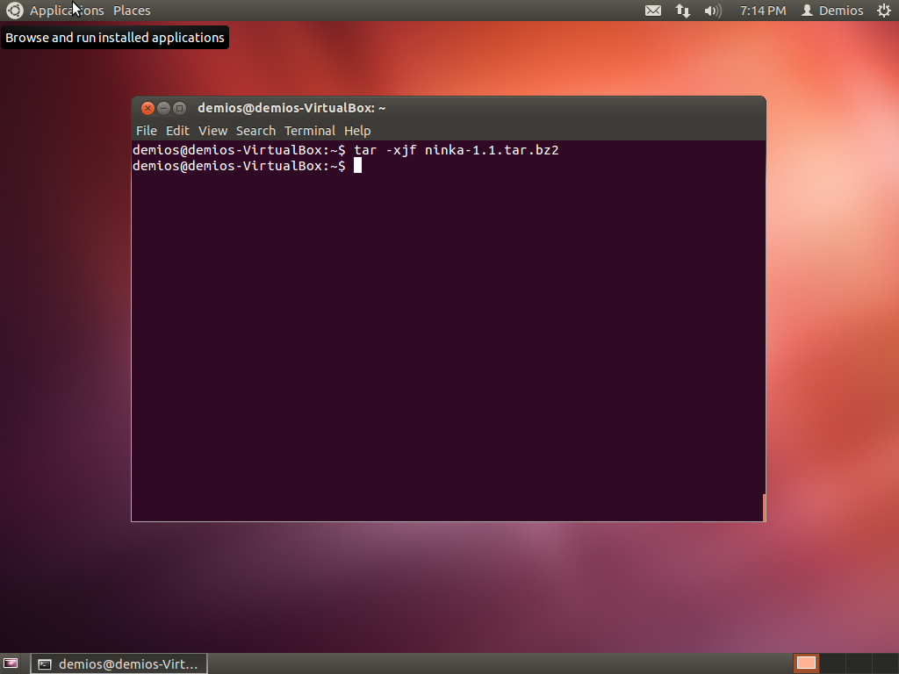
Next we have to unpack Ninka.  By default it's in whatever directory you used wget in.  If you move it to another directory (such as /usr/share), you may need to sudo the next part, because those directories are read-only by default.  Execute the command in the picture (tar -xjf [NAME OF NINKA RELEASE].tar.bz2) to extract Ninka.  The folder will be the same as whatever the name of the Ninka release is (minus the ".tar.bz2" part).

We've now installed Ninka.  Yes, that's really all it takes.  Pretty light compared to FOSSology.

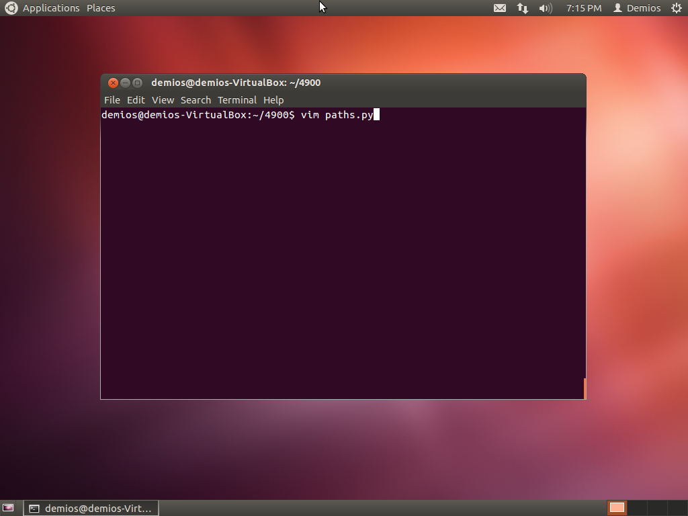
The FOSSology-Ninka tandem scanner has one more file that needs configuring before it can work properly.  The file is called "paths.py" (minus the quotes).  It contains the paths of the scanners and other tools that FOSSology and Ninka provide.

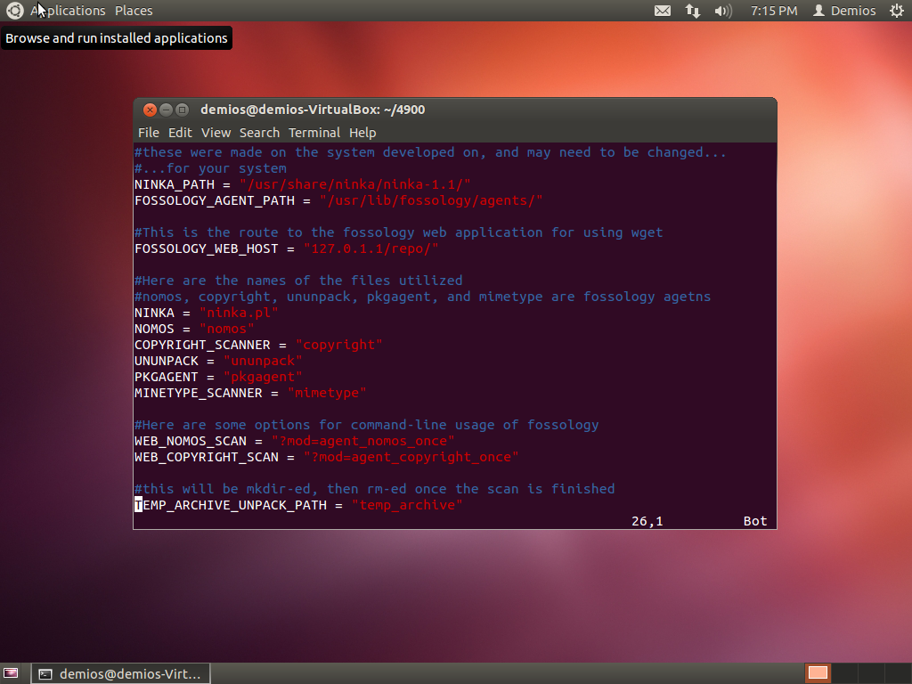
You will need to configure the paths to FOSSology and Ninka for the scanners to use them properly.  NINKA_PATH is wherever you installed your copy of Ninka.  FOSSOLOGY_AGENT_PATH is wherever a file called nomos is (on my system, it is /usr/lib/FOSSology/agents/").  Other agents are in that folder as well that may be used in future versions (such as ununpack).  The variable FOSSOLOGY_WEB_HOST is currently unused (it utilizes a different way of calling FOSSology to do a scan), but is kept incase future versions prefer that method.  If you intend to use that method, replace the web site name with your FOSSology home page on your apache server.  The other variables are things appended to the main paths to complete the absolute path to whatever is being called (for example, on my system, Ninka is called with /usr/share/Ninka/ninka-1.1/ninka.pl).  The names are unlikely to be different on your system.

Once all those steps are done, the FOSSology-Ninka system is successfully installed.

2. Running FOSSology-Ninka through the command line
--------------------------------------------------------

Next we will go through a mockup of what the system may look like once development is complete.  This section is through the command line.

From wherever the system is installed, run makeSPDX.py  with a file or package as an argument

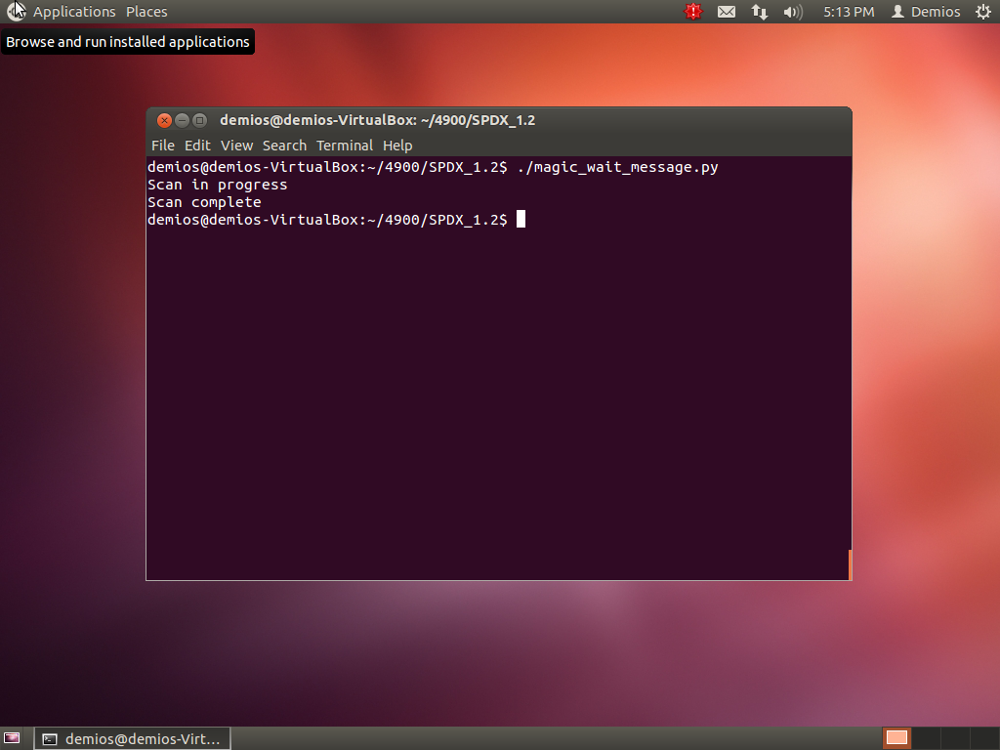
"Scan in progress" will show once the scan starts, and "scan complete" will show once the scan is done.
(note, there is no file actually called "magic_wait_message.py" anywhere, I just made that temporarily to show what it will look like, since the actual makeSPDX.py file doesn't do that yet, and time constraints prevented me from remaking it).

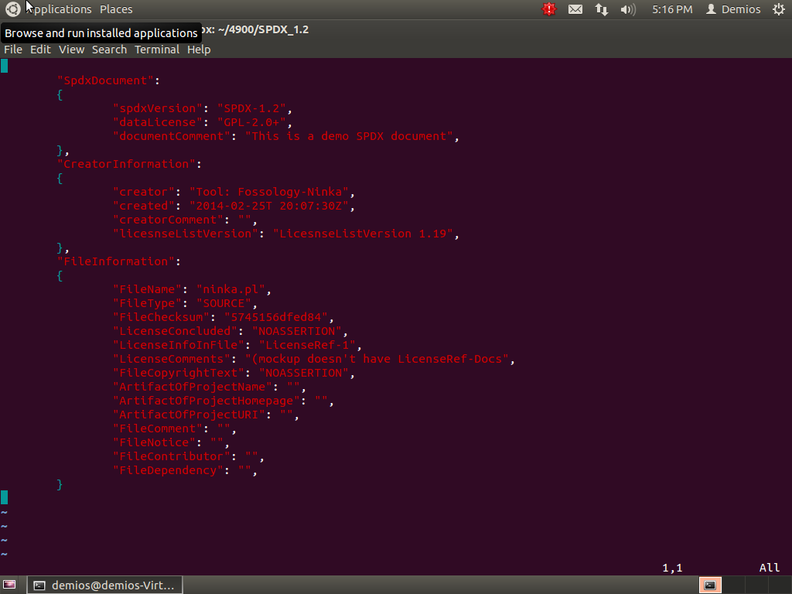
This is an example of the output of scanning ninka.pl.  The file is called ninka.pl_SPDX.json.  Since Ninka is a single file, this is relatively small.  Scans of packages such as busybox may be much larger.  (Also, this JSON has a few syntax errors with commas after the last member in a section, but the general idea is still there).  By default, the output file will be saved to somewhere on the system.  If it is being exported to another system, it can be fetched from there.  Because these SPDX files may need to be audited before they are accepted into the database, no direct database connection plan has been established.  However, the output can be easily translated for the planned SPDX database.

That is the basics of what running this process through the command line will look like from a user perspective.

3. Running FOSSology-Ninka through the web interface
---------------------------------------------------------

Next comes the user interface (which will probably not get done, since it that is the lowest priority of our tasks).

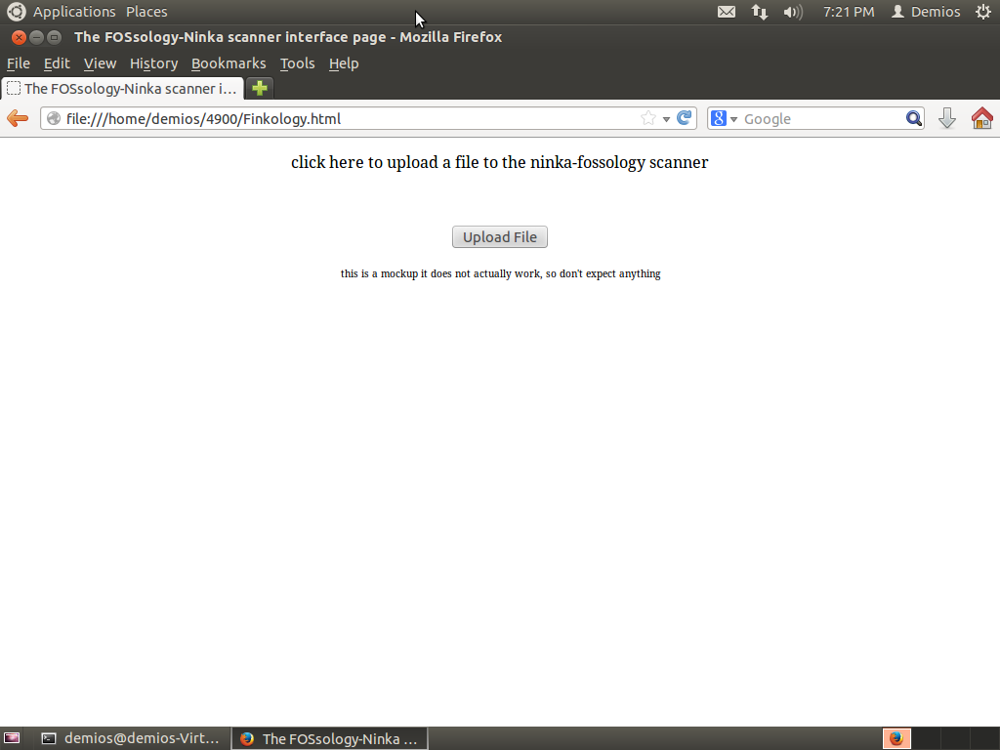
This is a crude idea of what the user interface may initially look like.  Upload a file or package and send it to the scanner.  After the scanner is finished, it will return the output file (see Fig_B3 for an example of that) to be downloaded to the user's system.

Optionally, if time permits (it most likely won't) an SPDX confirmation module (similar to FOSSology_SPDX) may be routed to instead where the user could configure the final details of the SPDX document and choose the download format.  However, that is a low priority task that will most likely not be attended to within this development cycle.  I am just listing it here for future versions.

4. Scan Breakdown
----------------------

Now that we know what to expect as a user, let's look a bit "under the hood" to see how the system is going to work point-by-point.  This is assuming the command-line model of access.  In the final version, all these processes will be handled internally (but they should be modular enough to be taken relatively piecemeal as stand-alone packages for other projects).

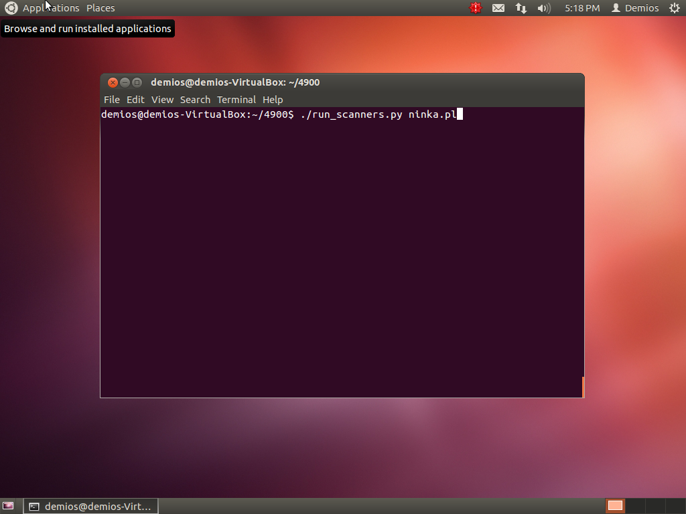
The system will first call a process called run_scanners.py, which will run both FOSSology and Ninka on a given file or package.  For simplicity’s sake (and because the package reader is not developed yet), we will use it on ninka.pl

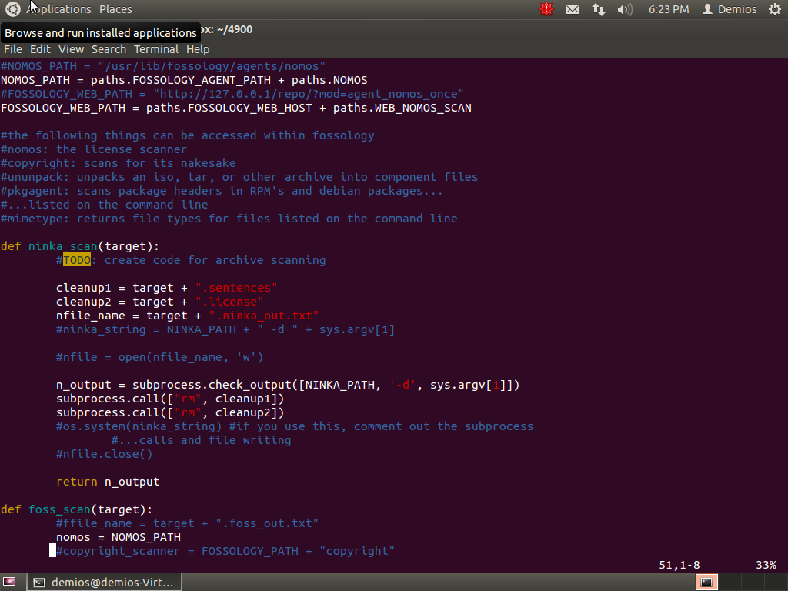
Here is a look under the hood as to how the dual scanner works.  It's a work in progress and admittedly a bit "messy."  However, this should give some idea as to what is going on when the scanners are called.

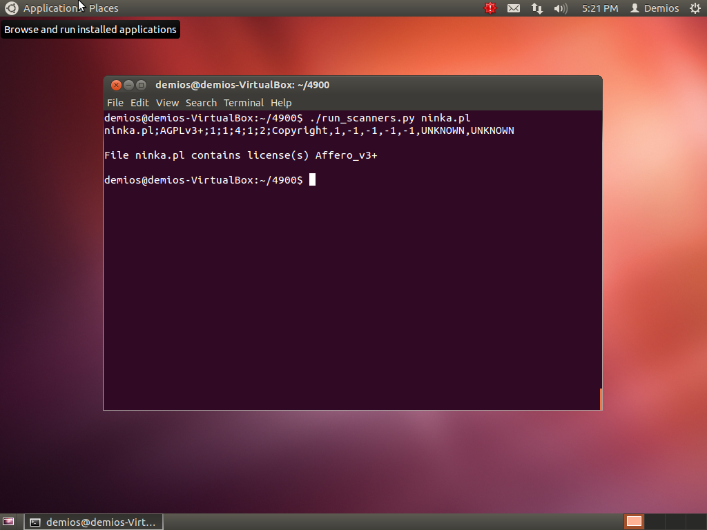
This is the output of the dual scanners.  The top one is Ninka's output and the bottom is FOSSology's (specifically, Nomos's).  In a larger package, there would be lines of Ninka output and lines of FOSSology output.  Instead of being written to the command line, they will be written to separate files (one indicating Ninka's output, one indicating FOSSology's output).  These are tentatively named [file].NINKA_OUT.txt and [file].FOSS_OUT.txt.

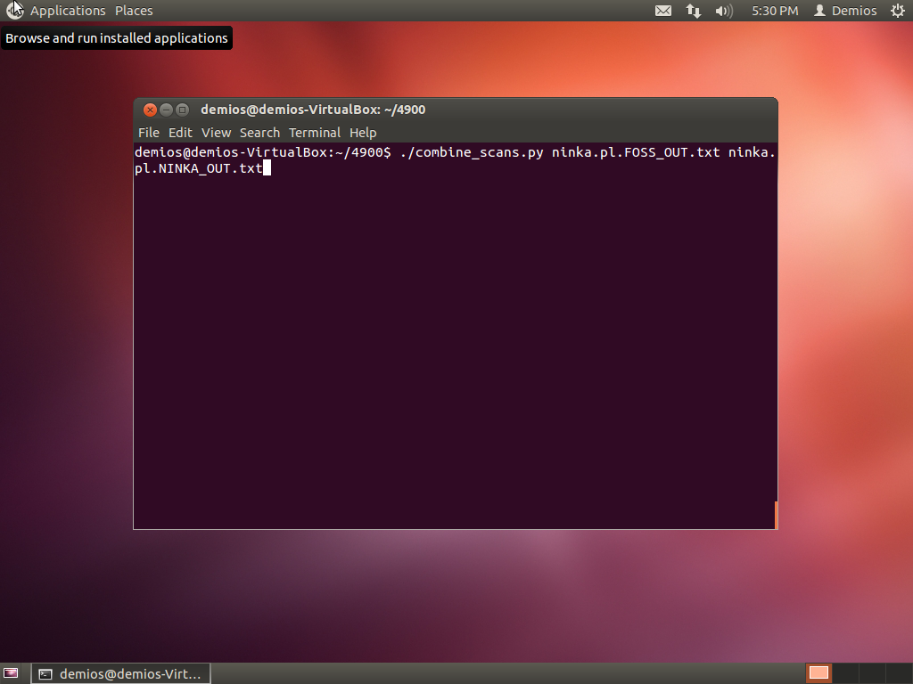
This combines the output of Ninka and FOSSology into a single simple language that can be processed later.  Because of time constraints, this process has not been created, so no code can be shown.  This is the expected input at the command line level.  Later, files or python lists (depending on what method is chosen) will be passed to the process instead of command line arguments.

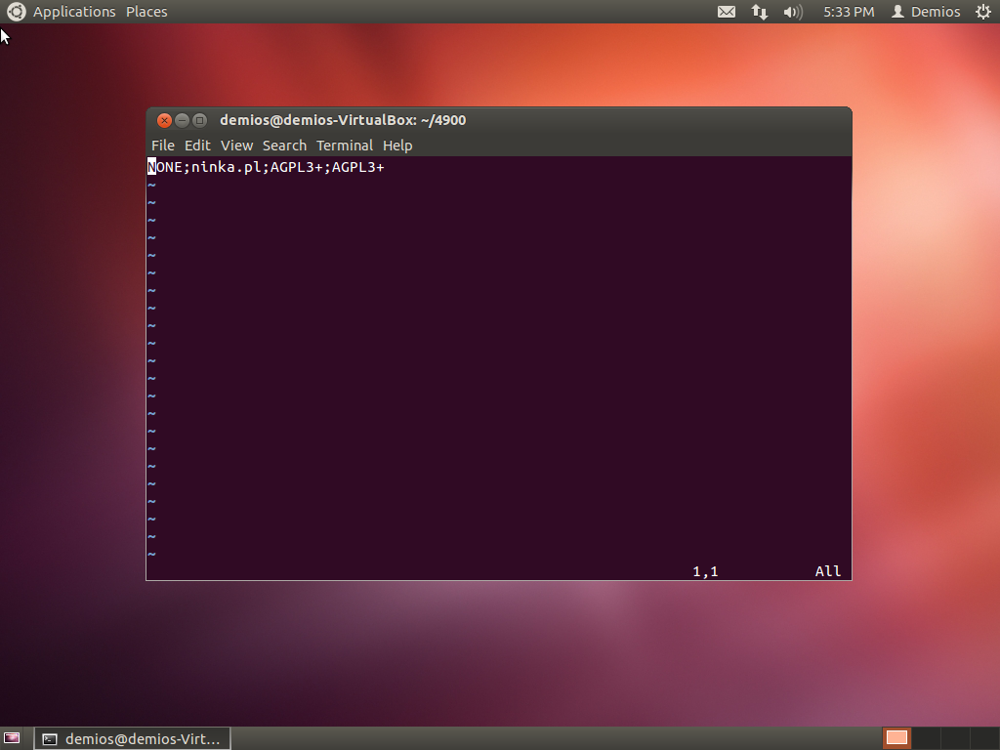
This is the tentative expected output of the scan combining process.  The language is akin to Ninka’s and it's meant for machine usability rather than human readability.  The format of the output is PACKAGE_NAME;FILE_NAME;NINKA_LICENSE(S);FOSSOLOGY_LICENSE(S).  If more than one license is found by Ninka or FOSSology, commas will be used to separate it.  The output here indicates that the file was a stand-alone file (hence, the package is NONE), the file is called ninka.pl, and both scanners found Affero GPL version 3 or newer.

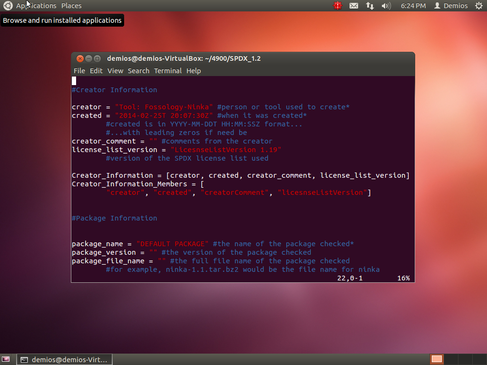
The next step is the SPDX generation itself.  There is currently no software that takes the combined output and makes an SPDX out of it (yet).  The makeSPDX process is just a mockup that pretends it was evaluating ninka.pl and writes a document accordingly.  However, the mockup does read from a structural library that may be used later (shown here).  This is a library of variables and basic data structures. (and is a very early version that needs to be revised). However, it shows the idea of some libraries and basic data structures to be called upon to create an SPDX document.

After that the SPDX document (shown in Fig_B3) will be saved to wherever it needs to be.

